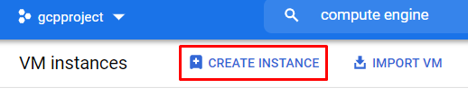
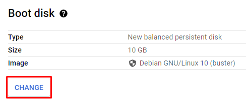
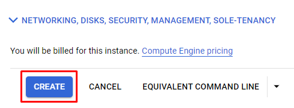
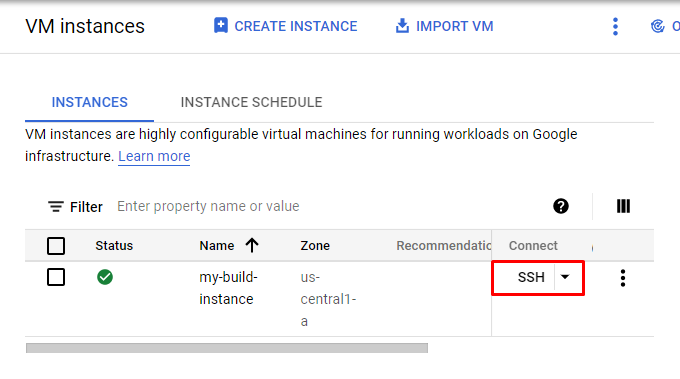
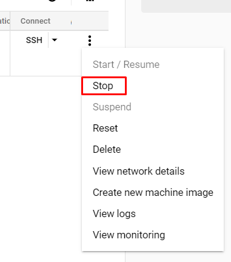

Next you'll create a new virtual machine and install some software on it. We'll then make a custom image of the machine's disk to use in your tracks.

Follow the instructions and screenshots below to create an Ubuntu 18.04 image with the openjdk java package installed on it.

Click on the **Create Instance** buttons on the VM Instances page:



Next, change the name of your VM instance to **my-build-instance**:


Change the boot disk for your instance to Ubuntu 18.04:



Select Ubuntu from the pop-in menu:


Finally click on the **Create** button at the bottom of the page:



Once your VM has finished booting up click on the **SSH** button to connect to it. A new window will pop open with your SSH terminal connection in it.



Run the following commands to install some packages:

```bash
sudo apt -y update
sudo apt -y install git openjdk-11-jre
```

Close your terminal window and stop the VM with the **Stop** menu item. You can find it under the triple dot menu for your VM:



Your virtual machine will gracefully shut down and the green checkmark will turn into a dark stop symbol with a square in it. Verify that your instance is stopped before going further.
