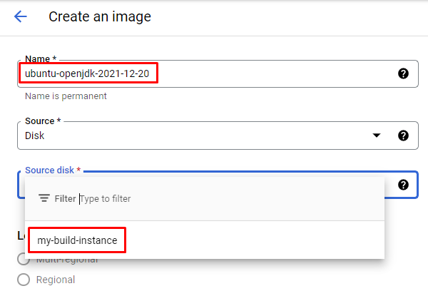
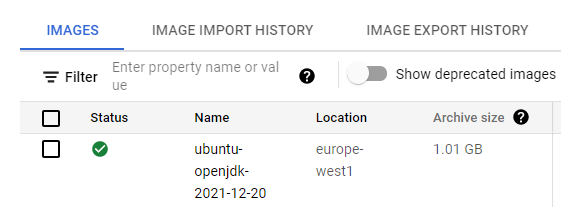

If you've come from AWS you might be familiar with the concept of an Amazon Machine Image (AMI).

On GCP things are a bit different. GCP Machine Images are a collection of OS, disks, metadata and settings that can be used to take an exact backup of a running machine.

Instruqt uses plain Images, also known as Custom Images, to create virtual machines.

In the next step make sure you select **Images** and not **Machine Images**.

At the top of the page select the **Create Image** button:

Give the image a descriptive name. In this example we'll use `ubuntu-openjdk-2021-12-20`.

Under **Source Disk** select the disk from **my-build-instance**.

Then set the **Location** to **Regional** and select **europe-west1**.

Optional: You may put more details into the **Description** field if you wish.

Finally click the **Create** button at the bottom of the page. It will take a minute or two for your custom image to be built. You'll know it's done when there's a green checkmark in the **Status** column:

Your new custom image is ready to use! Go to the next challenge to learn how to set up permissions for Instruqt to use the image.