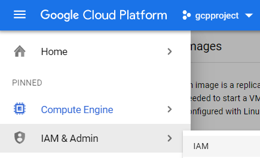
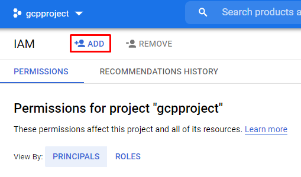

Important Note:
===============
The following steps no longer work in a temporary Instruqt sandbox. If you got this far in the tutorial, congratulations! The rest of the track steps explained below should be completed in your own Google Cloud Project where you plan to store your Instruqt images.

Grant Permission to Your Images
===============================

Browse to the IAM settings in your GCP console.



Create a new principal and paste the Instruqt service account email into the correct field. The Instruqt service account email is:

```
instruqt-track@instruqt-prod.iam.gserviceaccount.com
```



Grant the Compute Image User permission to the account and click the **Save** button.


That's it - now you can use your custom image in a track. Your config.yml should include the name of your project, a `/` and the name of your image. For example:

```
virtualmachines:
- name: workstation
  image: my-instruqt-project/ubuntu-openjdk-2021-12-20
  shell: /bin/bash
  machine_type: n1-standard-1
```

Remember - you'll need to repeat these steps in your company's Google organization since the Instruqt sandbox will be deleted soon.