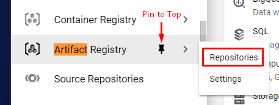

In this track we've created a new project for you to use. This sandbox project will be deleted after the track is stopped.

For production use, you should create a similar project in your company's GCP organization. You may need to ask your GCP admins to create a new project for you. Make sure they enable the Artifact Registry API for your project.

Right-click on the **Project ID** link on the left and open a new Incognito or InPrivate window. This ensures that you won't have a conflict with your personal or work account. Log in with the sandbox credentials provided on the **Google Project** tab. You will need to agree to the Google terms of service to continue.

Now use the navigation bar to open the Artifact Registry controls. The nav bar is opened by clicking the triple-line or "hamburger" menu on the upper left. You can pin the Artifact Registry option to the top of the menu by clicking on the thumbtack image. Select **Repositories** from the sub-menu.

Once you've selected the Artifact Registry Repositories move on to the next challenge.
