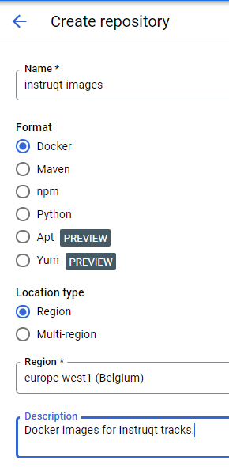

Create a New Repo
=================

Next you'll create a new Artifact Registry repo for storing Instruqt container images.

Click on the **Create Repository** button at the top of the page:

Call your repository **instruqt-images** and select **europe-west1** for the region. You may enter an optional description, everything else can be left as defaults:

Click on the blue **Create** button at the bottom of the page.

You can now use this repo to store Docker images. Click **Next** to move on to the next challenge.