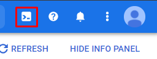
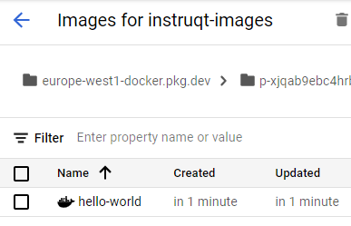

In this challenge we start up a Google Cloud Shell and install the Docker credential helper.

We will then pull the Docker Hello World image, tag it, and push it into our new registry.

Install the Credential Helper
====================================
Open a Google Cloud Shell by clicking on the little terminal icon in the upper right corner of the console:



Next, run the following command to configure the gcloud Docker credential helper:

```bash
gcloud auth configure-docker europe-west1-docker.pkg.dev
```

Fetch and Tag the Hello World Image
===================================

Pull the Docker Hello World image down to your Cloud Shell system:

```bash
docker pull hello-world
```

And tag it with your repository URL. The URL is structured like this:

```
europe-west1-docker.pkg.dev/<PROJECT_ID>/<REPO_NAME>/hello-world:latest
```

Run the following command to tag your image. If you used a different name for your repository than **instruqt-images** adjust the command below. Otherwise you can copy it exactly:

```bash
docker tag hello-world:latest europe-west1-docker.pkg.dev/${GOOGLE_CLOUD_PROJECT}/instruqt-images/hello-world:latest
```

NOTE: It's very important to get the tag correct so you can push your image in the next step!

Push the Container Image
========================

Run the following command to push your image to the new Google Artifact repo.

```bash
docker push europe-west1-docker.pkg.dev/${GOOGLE_CLOUD_PROJECT}/instruqt-images/hello-world:latest
```

And that's it, your container image is now stored in the Google Artifact Registry repo, and ready for use. Refresh the GCP console to see your image in the repo:



Move on to the final challenge to learn how to enable permissions for Instruqt to use the image in your tracks.