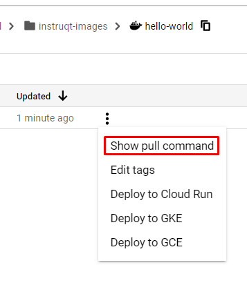

On the main Artifact Registry page you will see your **instruqt-images** repo. You can use the following link to return to the page:

https://console.cloud.google.com/artifacts

Click on the check box next to your repo and note the **Permissions** controls on the right side panel. Click on **ADD PRINCIPAL**.


In the **New Principals** box type in `allUsers`, with a lower case `a` and capital `U`. Choose the Artifact Registry >> Artifact Registry Reader option and click **SAVE**.


Click on **ALLOW PUBLIC ACCESS** in the popup window. Now your images can be used in Instruqt tracks.

Your config.yml should include the URL to your container image, the same as if you were running a `docker pull` command to fetch it. You can show an example pull command from the Google Console by clicking on the triple dot menu next to your image. Note the URL in the pull command - that is what you need to put into your **config.yml** image setting.



Here is an example snippet from a **config.yml** file:

```
virtualmachines:
- name: workstation
  image: europe-west1-docker.pkg.dev/your-project-id/instruqt-images/hello-world:latest
  shell: /bin/bash
  ports:
  - 80
  - 443
```

Remember - you'll need to repeat these steps in your company's Google organization since the Instruqt sandbox will be deleted soon.